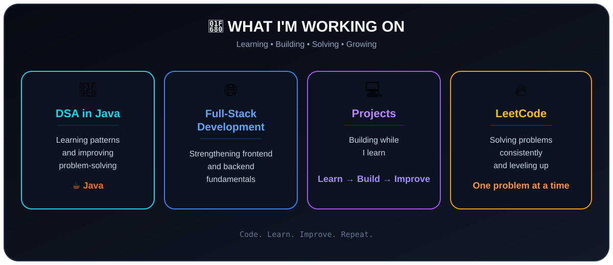

# 👋 Hi, I'm Krishi Patel

### MCA Student | Java & DSA | Full-Stack Development

---

## 🧑‍💻 About Me

Hi! I'm Krishi, an MCA student from Gujarat.

- 🎓 Currently pursuing MCA
- ☕ Working on **Java + DSA**
- 🧠 Solving LeetCode problems and learning DSA patterns
- 🌐 Learning and building with **Full-Stack Web Development**
- 💻 Learning by building small projects
- 🎯 Looking for a **6-month software development internship**

---

## 🛠️ What I'm Learning

  

### 🔧 Tools I Use

  

---

## 🧠 DSA

Currently learning DSA in Java and focusing on **understanding the logic and pattern behind each problem**.

- Two Pointers
- Fast & Slow Pointers
- Arrays & Strings
- Linked Lists
- Sliding Window

### 📚 Practice

🔹 **[LeetCode Solutions](https://github.com/Krishipatel29/Leetcode-Solutions)**

---

## 🚀 What I'm Working On

  

---

## 🤝 Connect With Me

&nbsp;

&nbsp;

---

## 🎯 2026 Goals

- [ ] Get stronger at DSA in Java
- [ ] Solve more LeetCode problems
- [ ] Build a few good Full-Stack projects
- [ ] Get a 6-month software development internship
- [ ] Keep improving step by step 💪

---

### 💙 Keep Learning • Keep Building • Keep Solving

